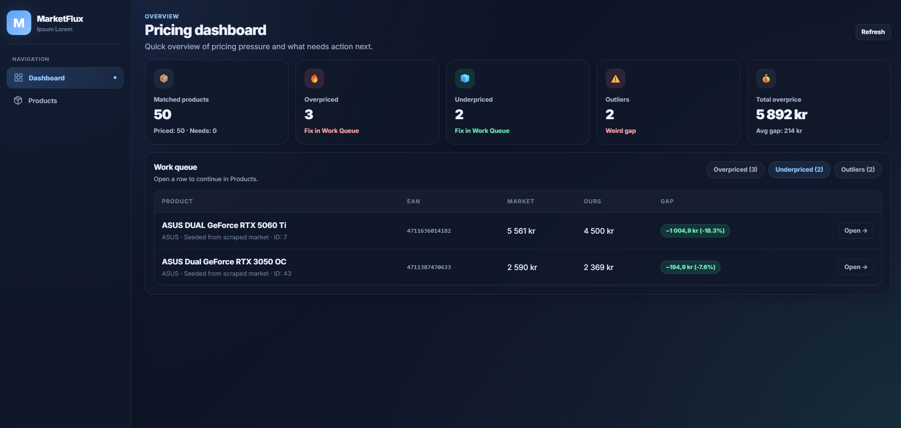
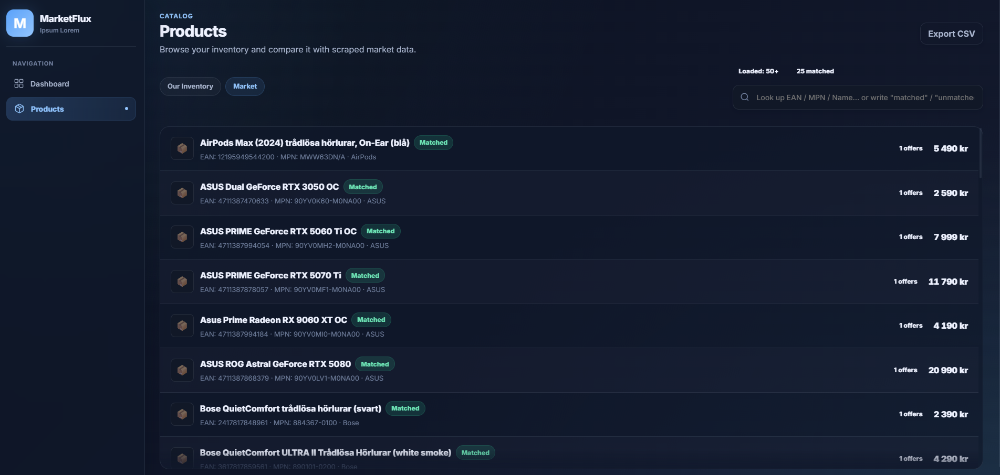
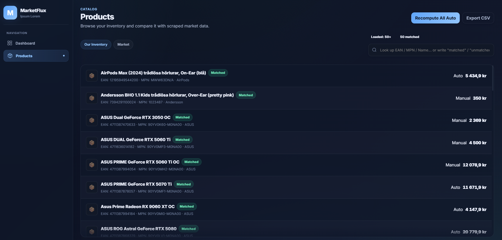

# Product-Data-Analyzer




**Product-Data-Analyzer** är ett examensprojekt byggt för att analysera egna produktpriser mot marknaden i en lokal dashboard.

Projektet består av:
- en **Spring Boot-backend**
- en **React/Vite-frontend**
- en separat **core pricing engine**
- en fristående **scraper-del** för att samla in marknadsdata

Fokus i nuläget är att:
- läsa in och visa eget sortiment från databasen
- jämföra produkter mot marknadsdata
- visa över-/underprissättning
- ge rekommenderade priser
- låta användaren växla mellan **AUTO** och **MANUAL**
- ge en enkel dashboard för överblick och åtgärder

---

# Översikt

Systemet arbetar i huvudsak med två dataperspektiv:

- **Our Inventory**
  Egna produkter från `company_listings`

- **Market**
  Marknadsdata från scrape:ade källor, aggregerat i `scraped_market_rollup`

Frontend visar detta i två huvudvyer:

- **Dashboard**
- **Products**

---

# Screenshots




---

# Nuvarande funktioner

## Dashboard
Dashboarden visar en snabb överblick över:
- antal matchade produkter
- antal överprissatta produkter
- antal underprissatta produkter
- antal outliers
- work queue för produkter som bör granskas

## Products
Products-vyn låter dig:
- växla mellan **Our Inventory** och **Market**
- söka i data
- scrolla igenom större datamängder
- öppna en produkt i drawer
- se market snapshot / erbjudanden
- justera prisläge på inventory-produkter

## Pricing
Projektet stödjer just nu:
- **AUTO**-läge
- **MANUAL**-läge
- rekommenderat pris baserat på market snapshot
- bulk-recompute för AUTO-produkter

---

# Teknisk struktur

## Backend
- Java 21
- Spring Boot
- Spring JDBC
- Spring Security
- PostgreSQL

## Frontend
- React 19
- Vite
- React Router
- Recharts installerat i frontend

## Core Engine
Den separata modulen `core-engine` innehåller pricing-logik och regler, till exempel:
- undercut-regler
- ignore-below-cost-regler
- post-processors som psykologisk prissättning

---

# Starta projektet

## Snabbaste sättet
I repo-roten finns ett PowerShell-script:

```powershell
.\start-dev.ps1
```
