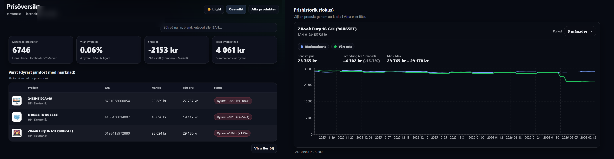
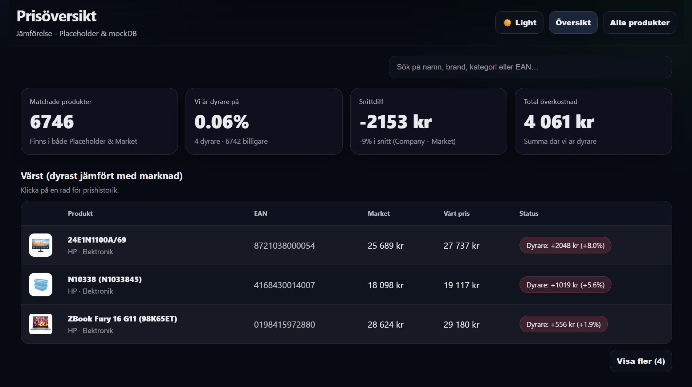
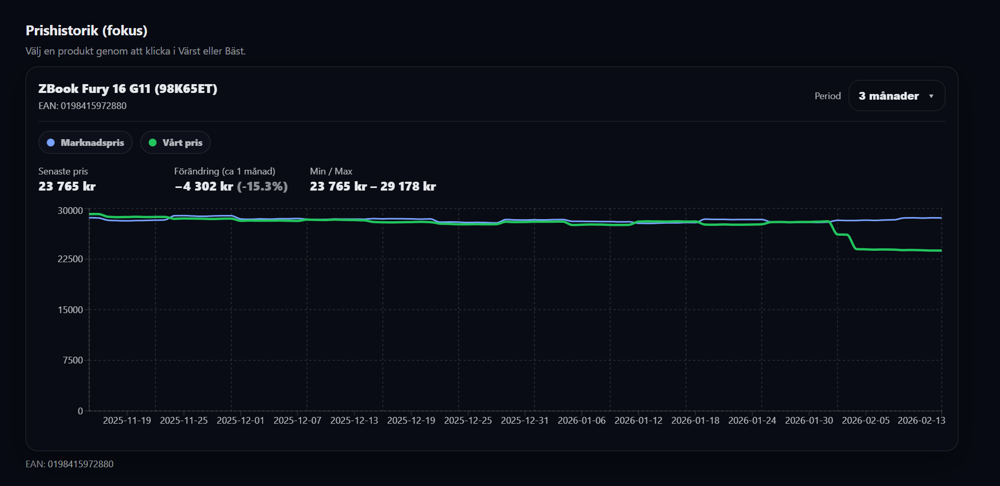
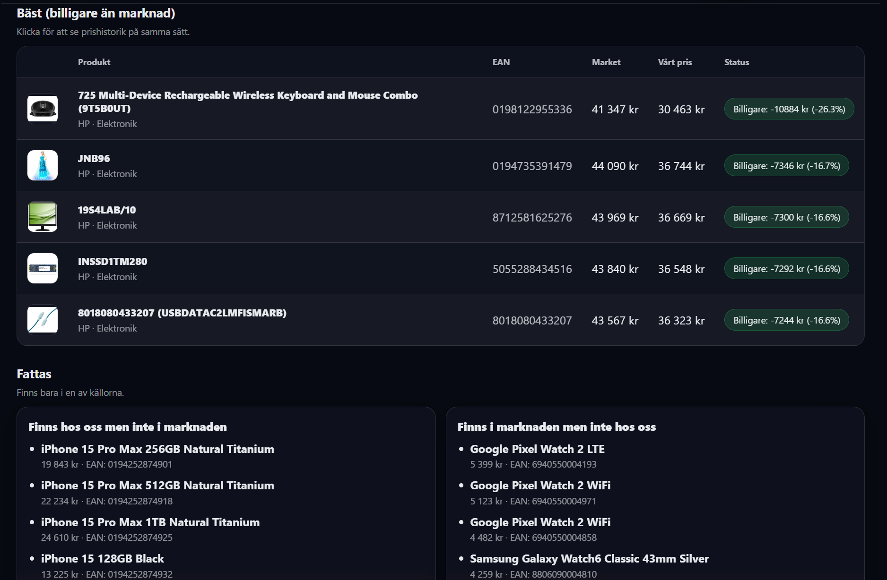
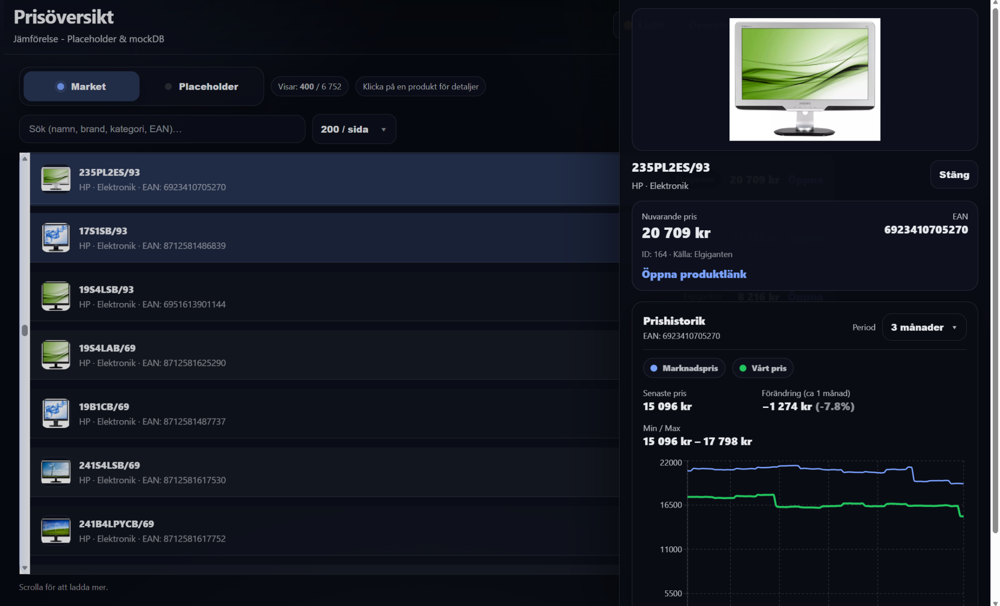

# Product-Data-Analyzer

En fullstack-applikation som tar produktfeeds via API eller maskinläsningsformat (JSON/XML/CSV), jämför aktuella produktpriser mot marknadsdata och visualiserar resultatet i en interaktiv dashboard. Systemet visar produktinformation, prisdifferenser, historik och analys i realtid.

---

## Projektet består av två huvuddelar

### Dashboard
Frontend byggd i React som presenterar produkter, prisjämförelser och historik i ett tydligt och responsivt gränssnitt.

### Backend
Backend byggd i Spring Boot som hanterar datainsamling, bearbetning, matchning och API-logik.

---

## Systemarkitektur
Frontend kommunicerar med backend via REST-API. Backend hämtar data från interna filer och externa källor, bearbetar informationen och returnerar strukturerad JSON som frontend visualiserar.

---

## Syfte
Syftet med projektet är att automatisera delar av processen kring produktanalys och prissättning. Istället för manuella kontroller kan systemet samla information, jämföra priser och presentera resultatet i ett gränssnitt som gör analysen snabbare och mer tillförlitlig.

---

## Screenshots

  

### Dashboard overview

  

### Price history

  

### Comparison view

  

### Product details

  

---

## Nuvarande funktioner
- Visning av produkter
- Prisjämförelse mellan marknadspris och eget pris
- Graf över prishistorik
- Periodfilter för historik
- Stabil datamodell med stöd för flera datakällor

---

## Planerade förbättringar
- Möjlighet att ändra produktpris direkt i dashboarden
- Integration av fler datakällor och API-tjänster
- Mer avancerad analys och rekommendationer
- Databasstöd istället för enbart filbaserad data

---

## Arkitekturprincip
Projektet är uppbyggt modulärt så att nya datakällor, funktioner och analysmetoder enkelt kan läggas till utan att ändra systemets grundstruktur.
